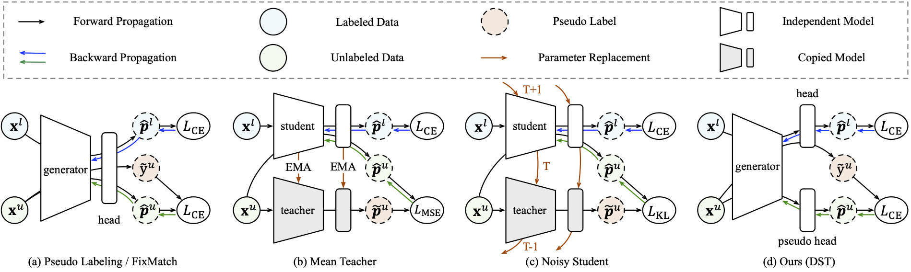
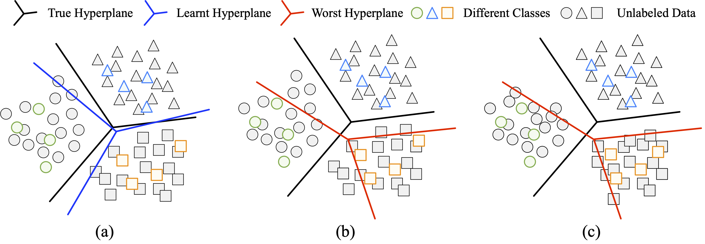

# Debiased-Self-Training-for-Semi-Supervised-Learning

Code release of paper Debiased Self-Training for Semi-Supervised Learning ([NeurIPS 2022 Oral](https://arxiv.org/abs/2202.07136)).

- [Updates](#updates)
- [Introduction](#introduction)
- [Installation](#installation)
- [Experiments](#experiments)
- [Contact](#contact)
- [Citation](#citation)
- [Acknowledgments](#acknowledgments)

## Updates

#### 2022.11

Code release. For usage, please see [Installation](#installation) part.

| [Code of training-from-scratch experiments (standard SSL benchmarks)](https://github.com/thuml/Transfer-Learning-Library/tree/dev-ssl/projects/dst) |
| ------------------------------------------------------------ |
| [**Code of fine-tuning experiments (ImageNet Pre-trained, ResNet50)**](https://github.com/thuml/Transfer-Learning-Library/tree/master/examples/semi_supervised_learning/image_classification) |

## Introduction

Debiased Self-Training (DST) tackles the bias issue in self-training process. DST can be implemented by only several lines of code and enjoys the following advantages.

- DST significantly **boosts the performance** (18.9% over FixMatch on 13 tasks). Meanwhile, it helps **stabilize training** and **improves performance balance**.
- DST can serve **as a general add-on** to mainstream self-training methods. Besides, the benefits of DST and recent popular techniques (dynamic thresholding, contrastive learning, etc.) are orthogonal.

Below, we briefly explain the main components of DST. For details, please refer to our paper. 

####	Decoupled Pseudo Labeling



First, we revisit the components of deep neural networks where the bias may accumulate. Our experiments suggest that the backbone has better tolerance to noisy pseudo labels than the classifier head. Based on this observation, we propose to introduce a complete parameter-independent pseudo head to take the duty of training with pseudo labels. As illustrated in (d), we **decouple the generation and utilization of pseudo labels**.

#### Worst Case Estimation



Further, we further propose a worst-case estimation to decrease bias in the feature space. This is achieved by introducing another worst-case head and a minimax game between the feature extractor and the worst-case head. We illustrate the idea in the above figure.

**(a)** Shift between the hyperplanes learned on limited labeled data and the true hyperplanes.

**(b)** The worst hyperplanes are hyperplanes that correctly distinguish labeled samples while making as many mistakes as possible on unlabeled samples.

**(c)** Feature representations are optimized to improve the performance of the worst hyperplanes.

## Installation

We release our code as part of [Transfer Learning Library (TLlib)](https://github.com/thuml/Transfer-Learning-Library#introduction). Currently, we maintain our code in two different folders of TLlib.

- [Code of training-from-scratch experiments (standard SSL benchmarks)](https://github.com/thuml/Transfer-Learning-Library/tree/dev-ssl/projects/dst)
- [Code of fine-tuning experiments](https://github.com/thuml/Transfer-Learning-Library/tree/master/examples/semi_supervised_learning/image_classification)

To use our code, you should **(1)** install TLliib, and **(2)** follow the instructions in the above links to install addtional dependencies. 

## Experiments

**We provide the running scripts as well as optimal hyperparameters in corresponding code.** The main results are shown below.

#### Standard SSL Benchmarks

| Methods       | CIFAR10 | CIFAR100 | SVHN | STL10 |
| ------------- | :-----: | :------: | :--: | :---: |
| FixMatch      |  92.9   |   53.7   | 98.0 | 62.5  |
| DST(FixMatch) |  94.0   |   60.0   | 97.7 | 78.0  |

#### Fine-Tuning Experiments

**Supervised Pre-Training**

| Methods      | Food101 | CIFAR10 | CIFAR100 | CUB200 | Aircraft | Cars | SUN397 | DTD  | Pets | Flowers | Caltech | Avg  |
| ------------ | :-----: | :-----: | :------: | :----: | :------: | :--: | :----: | :--: | :--: | :-----: | ------- | ---- |
| ERM          |  33.6   |  59.4   |   47.9   |  48.6  |   29.0   | 37.1 |  40.9  | 50.5 | 82.2 |  87.6   | 82.2    | 54.5 |
| Pseudo Label |  36.9   |  62.8   |   52.5   |  54.9  |   30.4   | 40.4 |  41.7  | 54.1 | 89.6 |  93.5   | 85.1    | 58.4 |
| Pi Model     |  34.2   |  66.9   |   48.5   |  47.9  |   26.7   | 37.4 |  40.9  | 51.9 | 83.5 |  92.0   | 82.2    | 55.6 |
| Mean Teacher |  40.4   |  78.1   |   58.5   |  52.8  |   32.0   | 45.6 |  40.2  | 53.8 | 86.8 |  92.8   | 83.7    | 60.4 |
| UDA          |  41.9   |  73.0   |   59.8   |  55.4  |   33.5   | 42.7 |  42.1  | 49.7 | 88.0 |  93.4   | 85.3    | 60.4 |
| FixMatch     |  36.2   |  74.5   |   58.0   |  52.6  |   27.1   | 44.8 |  40.8  | 50.2 | 87.8 |  93.6   | 83.2    | 59.0 |
| Self Tuning  |  41.4   |  70.9   |   57.2   |  60.5  |   37.0   | 59.8 |  43.5  | 51.7 | 88.4 |  93.5   | 89.1    | 63.0 |
| FlexMatch    |  48.1   |  94.2   |   69.2   |  65.1  |   38.0   | 55.3 |  50.2  | 55.6 | 91.5 |  94.6   | 89.4    | 68.3 |
| DebiasMatch  |  57.1   |  92.4   |   69.0   |  66.2  |   41.5   | 65.4 |  48.3  | 54.2 | 90.2 |  95.4   | 89.3    | 69.9 |
| DST          |  58.1   |  93.5   |   67.8   |  68.6  |   44.9   | 68.6 |  47.0  | 56.3 | 91.5 |  95.1   | 90.3    | 71.1 |
| Oracle       |  85.5   |  97.5   |   86.3   |  81.1  |   85.1   | 91.1 |  64.1  | 68.8 | 93.2 |  98.1   | 92.6    | 85.8 |

**Unsupervised Pre-Training**

| Methods      | Food101 | CIFAR10 | CIFAR100 | CUB200 | Aircraft | Cars | SUN397 | DTD  | Pets | Flowers | Caltech | Avg  |
| ------------ | :-----: | :-----: | :------: | :----: | :------: | :--: | :----: | :--: | :--: | :-----: | ------- | ---- |
| ERM          |  33.5   |  63.0   |   50.8   |  39.4  |   28.1   | 40.3 |  40.7  | 53.7 | 65.4 |  87.5   | 82.8    | 53.2 |
| Pseudo Label |  33.6   |  71.9   |   53.8   |  42.7  |   30.9   | 51.2 |  41.2  | 55.2 | 69.3 |  94.2   | 86.2    | 57.3 |
| Pi Model     |  32.7   |  77.9   |   50.9   |  33.6  |   27.2   | 34.4 |  41.1  | 54.9 | 66.7 |  91.4   | 84.1    | 54.1 |
| Mean Teacher |  36.8   |  79.0   |   56.7   |  43.0  |   33.0   | 53.9 |  39.5  | 54.5 | 67.8 |  92.7   | 83.3    | 58.2 |
| UDA          |  39.5   |  91.3   |   60.0   |  41.9  |   36.2   | 39.7 |  41.7  | 51.5 | 71.0 |  93.7   | 86.5    | 59.4 |
| FixMatch     |  44.3   |  86.1   |   58.0   |  42.7  |   38.0   | 55.4 |  42.4  | 53.1 | 67.9 |  95.2   | 83.4    | 60.6 |
| Self Tuning  |  34.0   |  63.6   |   51.7   |  43.3  |   32.2   | 50.2 |  40.7  | 52.7 | 68.2 |  91.8   | 87.7    | 56.0 |
| FlexMatch    |  50.2   |  96.6   |   69.2   |  49.4  |   41.3   | 62.5 |  47.2  | 54.5 | 72.4 |  94.8   | 89.4    | 66.1 |
| DebiasMatch  |  54.2   |  95.5   |   68.1   |  49.1  |   40.9   | 73.0 |  47.6  | 54.4 | 76.6 |  95.5   | 88.7    | 67.6 |
| DST          |  57.1   |  95.0   |   68.2   |  53.6  |   47.7   | 72.0 |  46.8  | 56.0 | 76.3 |  95.6   | 90.1    | 68.9 |
| Oracle       |  87.0   |  98.2   |   87.9   |  80.6  |   88.7   | 92.7 |  63.9  | 73.8 | 90.6 |  97.8   | 93.1    | 86.8 |

## Contact

If you have any questions or want to use the code, please contact

- Baixu Chen (cbx_99_hasta@outlook.com)
- Junguang Jiang (JiangJunguang1123@outlook.com)

## Citation

If you find this code useful, please cite our paper.

```
@article{DST,
    title={Debiased Self-Training for Semi-Supervised Learning},
    author={Chen, Baixu and Jiang, Junguang and Wang, Ximei and Wang, Jianmin and Long, Mingsheng},
    journal={arXiv preprint arXiv:2202.07136},
    year={2022}
}
```

## Acknowledgments

We appreciate the following github repos for their valuable codebase:
- https://github.com/xternalz/WideResNet-pytorch
- https://github.com/kekmodel/FixMatch-pytorch
- https://github.com/TorchSSL/TorchSSL

